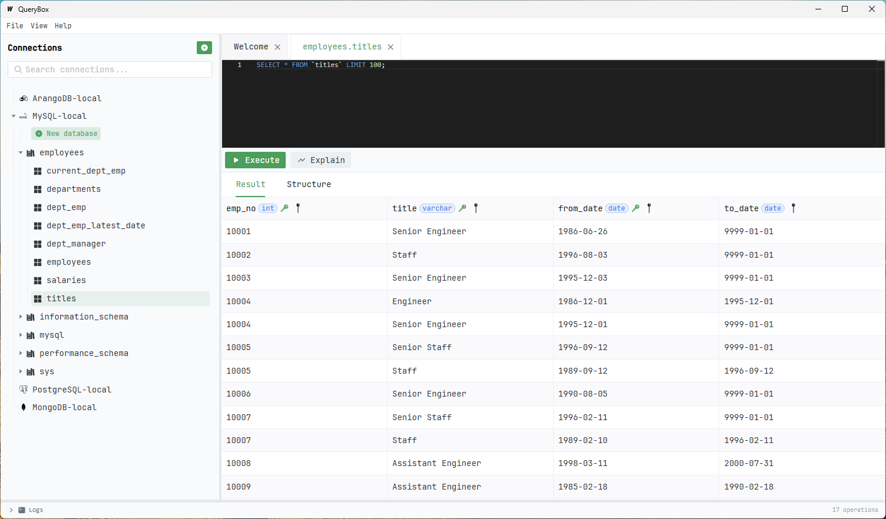

# QueryBox (Current under development - Not released)

**QueryBox** is a database management tool for executing and managing queries across multiple database systems through a plugin-based architecture.



## Prerequisites

| Tool | Version | Purpose |
|------|---------|---------|
| [Go](https://go.dev/dl/) | 1.24+ | Backend |
| [Wails v3](https://v3alpha.wails.io/getting-started/installation/) | v3 alpha | Desktop framework |
| [Task](https://taskfile.dev/installation/) | latest | Build automation |
| [Node.js](https://nodejs.org/) | 18+ | Frontend tooling |
| [protoc](https://grpc.io/docs/protoc-installation/) + [protoc-gen-go](https://pkg.go.dev/google.golang.org/protobuf/cmd/protoc-gen-go) + [protoc-gen-go-grpc](https://pkg.go.dev/google.golang.org/grpc/cmd/protoc-gen-go-grpc) | libprotoc 29.6 / protoc-gen-go v1.36.10 / protoc-gen-go-grpc v1.6.1 | gRPC code generation (only if modifying `.proto` files) |

## Getting Started

### Install dependencies

```bash
# Install Task (build tool)
go install github.com/go-task/task/v3/cmd/task@latest
# or using npm
npm install -g taskfile
# Install Wails CLI
go install github.com/wailsapp/wails/v3/cmd/wails@latest
# Install protoc-gen-go (only needed if modifying .proto files)
go install google.golang.org/protobuf/cmd/protoc-gen-go@v1.36.10
# Install protoc-gen-go-grpc (only needed if modifying .proto files)
go install google.golang.org/grpc/cmd/protoc-gen-go-grpc@v1.6.1
# Install protoc (see https://grpc.io/docs/protoc-installation/)=
```

### Clone the repository

```bash
git clone https://github.com/your-username/querybox.git
cd querybox
```

### Run in Development Mode

```bash
# Start the app with hot-reload
wails3 dev
```

Both frontend and backend changes are hot-reloaded automatically.

### Build the Application

```bash
wails3 build
```

The production executable is placed in `bin/`.

### Build Plugins

Plugins are standalone executables that live in `bin/plugins/` (on Windows the files will have `.exe` suffix).
The app discovers them automatically at runtime.

```bash
# Build all plugins at once
task build:plugins
```

By default the host OS is detected; you can override using standard Go
cross‑compile vars:

```bash
GOOS=windows GOARCH=amd64 task build:plugins
```

Binaries are placed in `bin/plugins/` (Windows builds get `.exe`) and picked up by the app within 2 seconds.

### Create a New Plugin

1. Copy the template:
   ```bash
   cp -r plugins/template plugins/<your-plugin-name>
   ```

2. Edit `plugins/<your-plugin-name>/main.go` — implement the four commands:
   - `info` — return plugin metadata (name, version, type)
   - `authforms` — return auth form definitions for the UI
   - `exec` — execute a query and return results
   - `connection-tree` — return a browsable object hierarchy

3. Build and drop the binary:
   ```bash
   task build:plugins
   ```

4. The running app will discover the new plugin automatically (no restart needed).

See [docs/plugins.md](docs/plugins.md) for the full plugin contract and examples.

## Project Structure

```
├── main.go                     # Application entry point
├── services/                   # Core services (connection, credential, plugin manager)
├── pkg/plugin/                 # Plugin SDK — ServeCLI helper and type aliases
├── plugins/                    # Plugin source code
│   ├── mysql/
│   ├── postgresql/
│   ├── sqlite/
│   └── template/               # Starting point for new plugins
├── contracts/plugin/v1/        # Protobuf definitions
├── rpc/contracts/plugin/v1/    # Generated Go code (pluginpb)
├── frontend/                   # Vue 3 frontend
├── docs/                       # Design and architecture documentation
├── scripts/                    # Build helper scripts
└── build/                      # Platform-specific build configuration
```

## Documentation

- [Plugin Development Guide](docs/plugins.md)
- [Basic Design Overview](docs/basic-design/overview.md)
- [Architecture](docs/detailed-design/architecture.md)
- [Data Model](docs/detailed-design/data-model.md)
