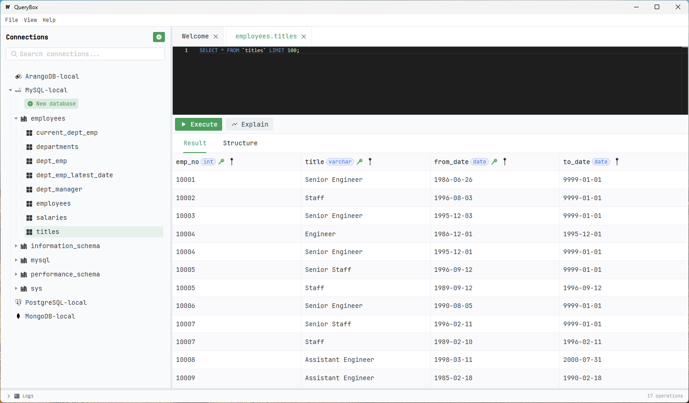

# QueryBox

**QueryBox** is a local-first operational workspace for backend engineers who need to inspect, query, debug, and operate data systems from one desktop app. It uses plugins to expose system-specific resources and actions while keeping runtime execution on the user's machine.



Today's implementation is still strongest on database workflows, but the product direction is broader than a database GUI. QueryBox is intentionally focused on operational workflows rather than becoming a general-purpose admin console or an AI-first product.

## Product Direction

- **Target user:** backend engineers working across databases, queues, object stores, logs, and other operational systems.
- **Primary workflows:** inspect, query, debug, and operate systems through a single local workspace.
- **Runtime principle:** local-first by default. No account, control plane, or cloud dependency is required for core usage.
- **Product boundary:** optimize for resource-oriented workflows, not broad infrastructure administration.
- **Terminology direction:** `connection/profile -> resource graph -> actions -> results/streams`.

## Prerequisites

| Tool | Version | Purpose |
|------|---------|---------|
| [Go](https://go.dev/dl/) | >=1.26.1 | Backend |
| [Wails v3](https://v3.wails.io/getting-started/installation/) | v3.0.0-alpha.98 | Desktop framework |
| [Task](https://taskfile.dev/installation/) | latest | Build automation |
| [Node.js](https://nodejs.org/) | >=24 | Frontend tooling |
| [protoc](https://grpc.io/docs/protoc-installation/) + [protoc-gen-go](https://pkg.go.dev/google.golang.org/protobuf/cmd/protoc-gen-go) + [protoc-gen-go-grpc](https://pkg.go.dev/google.golang.org/grpc/cmd/protoc-gen-go-grpc) | libprotoc 29.6 / protoc-gen-go v1.36.10 / protoc-gen-go-grpc v1.6.1 | gRPC code generation (only if modifying `.proto` files) |

## Getting Started

### Install dependencies

```bash
# Install Task (build tool)
go install github.com/go-task/task/v3/cmd/task@latest
# or using npm
npm install -g taskfile

# Install Wails CLI
go install github.com/wailsapp/wails/v3/cmd/wails3@v3.0.0-alpha.98

# Install protoc-gen-go (only needed if modifying .proto files)
go install google.golang.org/protobuf/cmd/protoc-gen-go@v1.36.10

# Install protoc-gen-go-grpc (only needed if modifying .proto files)
go install google.golang.org/grpc/cmd/protoc-gen-go-grpc@v1.6.1

# Install protoc (see https://grpc.io/docs/protoc-installation/)
```

### Clone the repository

```bash
git clone https://github.com/your-username/querybox.git
cd querybox
```

### Run in Development Mode

```bash
# Start the app with hot-reload
wails3 dev
```

Both frontend and backend changes are hot-reloaded automatically.

### Build the Application

```bash
wails3 build
```

The production executable is placed in `bin/`.

### Build Plugins

Plugins are standalone executables that normally live in `bin/plugins/` (on Windows the files will have a `.exe` suffix). At startup the app copies whatever lives in the bundled `bin/plugins` into the per-user config directory (`%APPDATA%\querybox\plugins`, `$XDG_CONFIG_HOME/querybox/plugins`, etc.), overwriting existing copies. The host then scans both locations, with the user directory taking precedence; this allows the bundle to be updated while still letting users add or override drivers.

```bash
# Build all plugins at once
task build:plugins
```

By default the host OS is detected; you can override using standard Go
cross‑compile vars:

```bash
GOOS=windows GOARCH=amd64 task build:plugins
```

Binaries are placed in `bin/plugins/` (Windows builds get `.exe`) and picked up by the app within 2 seconds.

### Create a New Plugin

1. Copy the template:
   ```bash
   cp -r plugins/template plugins/<your-plugin-name>
   ```

2. Edit `plugins/<your-plugin-name>/plugin.json` to declare the manifest v1 metadata:
   - `id`, `type`, `version`, `runtime`
   - `capabilities`, `permissions`, `limits`

3. Edit `plugins/<your-plugin-name>/main.go` — implement the four commands:
   - `info` — return plugin metadata (name, version, type)
   - `authforms` — return auth form definitions for the UI
   - `exec` — execute a query and return results
   - `resource-graph` — return a browsable resource hierarchy

   The current shipping contract is centered on `resource-graph` and query-style execution. Bundled plugins are expected to ship a valid manifest and the runtime no longer falls back to legacy browse contracts.

4. Build and drop the binary:
   ```bash
   task build:plugins
   ```

5. The running app will discover the new plugin automatically (no restart needed).

See [docs/features/plugin-system.md](docs/features/plugin-system.md) for the full plugin contract and examples.

## Project Structure

```
├── main.go                     # Application entry point
├── services/                   # Core services (connection, credential, plugin manager)
├── pkg/plugin/                 # Plugin SDK — ServeCLI helper and type aliases
├── plugins/                    # Plugin source code
│   ├── mysql/
│   ├── postgresql/
│   ├── sqlite/
│   └── template/               # Starting point for new plugins
├── contracts/plugin/v1/        # Protobuf definitions
├── rpc/contracts/plugin/v1/    # Generated Go code (pluginpb)
├── frontend/                   # Vue 3 frontend
├── docs/                       # Canonical product, development, and architecture documentation
│   └── adr/                    # Architecture decision records
├── scripts/                    # Build helper scripts
└── build/                      # Platform-specific build configuration
```

## Documentation

See [docs/index.md](docs/index.md) for the full documentation map. Quick links:

- [System overview](docs/architecture/system-overview.md)
- [Plugin system](docs/features/plugin-system.md)
- [Query editor auto‑completion](docs/features/query-editor-autocomplete.md)

## Third-Party Licenses

| Component | License | Notes |
|-----------|---------|-------|
| [JetBrains Mono](https://github.com/JetBrains/JetBrainsMono) | [Apache 2.0](frontend/public/LICENSE-JetBrainsMono) | Font used in the UI |

## License
This project is licensed under the MIT License. See the [LICENSE](LICENSE) file for details.
