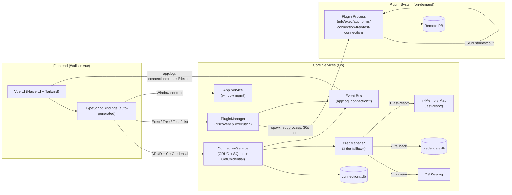

# Architecture

## System Diagram

---

## Components

| Component | Location | Wails-bound | Responsibility |
|-----------|----------|-------------|---------------|
| App Service | `services/app.go` | ✓ | Window lifecycle (maximize, minimize, fullscreen, close) |
| ConnectionService | `services/connection.go` | ✓ | Connection CRUD, credential delegation, event emission |
| PluginManager | `services/pluginmgr/pluginmgr.go` | ✓ | Plugin discovery, registry, on-demand execution |
| CredManager | `services/credmanager/credmanager.go` | ✗ | Secure secret storage with 3-tier fallback |

### ConnectionService — Public API

| Method | Signature | Description |
|--------|-----------|-------------|
| `ListConnections` | `(ctx) → ([]Connection, error)` | All connections, newest first |
| `CreateConnection` | `(ctx, name, driverType, credential) → (Connection, error)` | Store credential via CredManager, persist metadata, emit `connection:created` |
| `GetConnection` | `(ctx, id) → (Connection, error)` | Single connection by ID |
| `GetCredential` | `(ctx, id) → (string, error)` | Raw credential blob for plugin requests |
| `DeleteConnection` | `(ctx, id) → error` | Delete metadata + credential, emit `connection:deleted` |

### PluginManager — Public API

| Method | Description |
|--------|-------------|
| `ListPlugins()` | Returns all discovered plugins with rich metadata |
| `Rescan()` | Immediate synchronous plugin scan |
| `ExecPlugin(name, conn, query, opts)` | Run `plugin exec`, 30s timeout → `ExecResponse` |
| `GetPluginAuthForms(name)` | Run `plugin authforms` → structured auth form definitions |
| `GetConnectionTree(name, conn)` | Run `plugin connection-tree`, 30s timeout → `ConnectionTreeResponse` |
| `ExecTreeAction(name, conn, query, opts)` | Delegates to `ExecPlugin` with action query |
| `TestConnection(name, conn)` | Run `plugin test-connection`, **15s** timeout → `TestConnectionResponse` |

---

## Key Flows

### Connection Creation
1. Frontend → `ConnectionService.CreateConnection(name, driver, credentialJSON)`
2. ConnectionService generates UUID; derives `credential_key = "connection:<uuid>"`
3. `CredManager.Store(credential_key, credentialJSON)` — tries keyring, then sqlite fallback, then memory
4. Metadata + `credential_key` persisted to `data/connections.db`
5. `connection:created` event emitted → frontend updates list reactively (no re-fetch)

### Query Execution
1. Frontend → `PluginManager.ExecPlugin(pluginName, connParams, query)`
2. PluginManager looks up plugin path from registry
3. Spawns subprocess: `plugin exec` with 30s context timeout
4. Stdin: `{"connection": {...}, "query": "...", "options": {...}}`
5. Plugin executes, writes proto-JSON `ExecResponse` to stdout
6. PluginManager unmarshals via `protojson`, returns typed result
7. Plugin process exits

### Connection Tree Browsing
1. Frontend → `PluginManager.GetConnectionTree(pluginName, connParams)`
2. Spawns `plugin connection-tree`, 30s timeout; stdin: `{"connection": {...}}`
3. Plugin returns `{"nodes": [...]}` — hierarchical structure with optional `actions` per node
4. Node action → `ExecTreeAction` → delegates to `ExecPlugin` with action's query string

### Test Connection (no persistence)
1. User clicks **Test Connection** in New Connection form (no save)
2. Frontend → `PluginManager.TestConnection(driver, connParams)`
3. Spawns `plugin test-connection`, **15s** timeout; stdin: `{"connection": {...}}`
4. Plugin: `db.Open` + `db.Ping()` → stdout: `{"ok": true|false, "message": "..."}`
5. Frontend shows inline ✓/✗ indicator with plugin's message

### Connection Deletion
1. Frontend → `ConnectionService.DeleteConnection(id)`
2. Look up `credential_key`, call `CredManager.Delete`
3. Remove row from `data/connections.db`
4. `connection:deleted` event emitted → frontend removes entry from state
