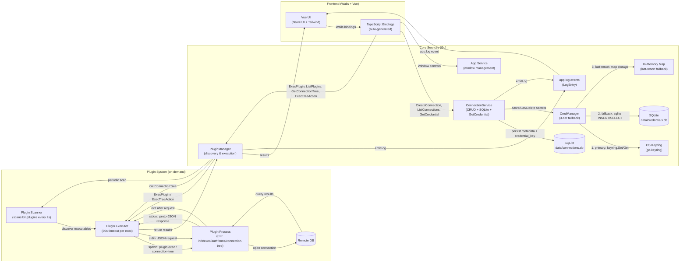

# Architecture — detailed diagram

## Diagram

---

## Query & Credential Flow

1. **Connection Creation**:
   - Frontend calls `ConnectionService.CreateConnection(name, driverType, credential)` via Wails bindings.
   - ConnectionService generates a UUID and creates `credential_key` (format: `"connection:<uuid>"`).
   - Credential JSON is stored via `CredManager.Store(credential_key, credential)`.
   - CredManager tries OS keyring first; falls back to sqlite file (`data/credentials.db`); final fallback is in-memory map.
   - Only connection metadata + `credential_key` reference persisted in `data/connections.db`.

2. **Credential Retrieval**:
   - Frontend calls `ConnectionService.GetCredential(id)` to obtain the stored credential for a connection.
   - ConnectionService looks up `credential_key` from SQLite, then calls `CredManager.Get(credential_key)`.
   - CredManager checks: OS keyring → sqlite fallback → in-memory map. Returns error only if all three miss.

3. **Plugin Discovery**:
   - PluginManager scans `bin/plugins/` every 2 seconds for executables.
   - For new plugins, probes metadata: `plugin info` (2s timeout).
   - Stores discovered plugins in memory registry: `{name, path, type, version, description}`.
   - `Rescan()` triggers an immediate synchronous scan.

4. **Query Execution**:
   - Frontend calls `PluginManager.ExecPlugin(pluginName, connectionParams, query)`.
   - PluginManager looks up plugin path from registry.
   - Spawns subprocess: `plugin exec` with 30-second context timeout.
   - Sends JSON via stdin: `{"connection": {...}, "query": "SELECT ..."}`.
   - Plugin opens database connection, executes query, writes proto-JSON result to stdout.
   - PluginManager reads stdout/stderr, unmarshals via `protojson`, returns typed `ExecResponse` to frontend.
   - Plugin process exits automatically after response.

5. **Connection Tree Browsing**:
   - Frontend calls `PluginManager.GetConnectionTree(pluginName, connectionParams)`.
   - PluginManager spawns `plugin connection-tree` with 30-second timeout.
   - Sends JSON via stdin: `{"connection": {...}}`.
   - Plugin returns `{"nodes": [...]}` — hierarchical tree with optional `actions` per node.
   - When user activates a tree-node action, frontend calls `PluginManager.ExecTreeAction(pluginName, connectionParams, actionQuery)` which delegates to `ExecPlugin`.

6. **Connection Deletion**:
   - Frontend calls `ConnectionService.DeleteConnection(id)`.
   - ConnectionService looks up `credential_key` from SQLite, then calls `CredManager.Delete(credential_key)`.
   - CredManager removes from keyring (best-effort), sqlite fallback, and in-memory map.
   - Connection metadata removed from `data/connections.db`.

---

## Notes & Security Callouts

- **Credential Storage**: `CredManager` uses a 3-tier fallback — OS keyring (`go-keyring`) → persistent sqlite file (`data/credentials.db`) → in-memory map. Only the last tier is ephemeral (cleared on restart).
- **No Plaintext on Disk**: `data/connections.db` stores only `credential_key` references (TEXT), never plaintext secrets or encrypted blobs.
- **Plugin Communication**: CLI-based JSON interchange via stdin/stdout using proto-derived types. Plugins are short-lived (30s timeout max).
- **Plugin Contract**: Four commands — `info` (metadata), `exec` (query execution), `authforms` (auth form definitions), `connection-tree` (hierarchical browse structure).
- **Schema Migration**: Automatic migration from old `credential_blob` column to `credential_key` + keyring model on startup.
- **Concurrent Safety**: CredManager uses `sync.RWMutex` for thread-safe fallback map access.
- **Event System**: Services emit structured `app:log` events (`LogEntry{Level, Message, Timestamp}`) to the frontend via Wails; registered as typed TypeScript bindings in `main.go`.
- **Service Bindings**: Frontend calls Go services via Wails bindings (type-safe TypeScript generated from Go).
- **Window Management**: App service provides window controls (maximize, minimize, fullscreen, close) for main and connections windows.
- **Plugin Discovery**: Background scanner with 2-second interval; `Rescan()` available for manual refresh.
- **Error Handling**: Plugin failures captured with stderr output; `ExecPlugin` degrades to wrapping raw text output in a `kv` result.

> **Current Implementation**: Focused on simplicity and cross-platform compatibility. OS keyring preferred; sqlite-file fallback provides persistence in headless/server environments; in-memory map is the last resort ensuring usability everywhere.
