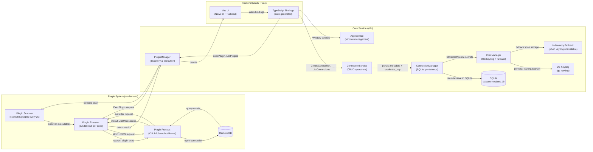

# Architecture — detailed diagram

## Diagram

---

## Query & Credential Flow

1. **Connection Creation**:
   - Frontend calls `ConnectionService.CreateConnection(name, driverType, credential)` via Wails bindings.
   - ConnectionManager generates a UUID and creates `credential_key` (format: `"connection:<uuid>"`).
   - Credential JSON is stored via `CredManager.Store(credential_key, credential)`.
   - CredManager attempts OS keyring first (`keyring.Set`), falls back to in-memory map if unavailable.
   - Only connection metadata + `credential_key` reference persisted in SQLite.

2. **Plugin Discovery**:
   - PluginManager scans `bin/plugins/` every 2 seconds for executables.
   - For new plugins, probes metadata: `plugin info` (2s timeout).
   - Stores discovered plugins in memory registry: `{name, path, type, version, description}`.

3. **Query Execution**:
   - Frontend calls `PluginManager.ExecPlugin(pluginName, connectionParams, sql)`.
   - PluginManager looks up plugin path from registry.
   - Spawns subprocess: `plugin exec` with 30-second context timeout.
   - Sends JSON via stdin: `{"connection": {...}, "sql": "SELECT ..."}`.
   - Plugin opens database connection, executes query, writes result to stdout.
   - PluginManager reads stdout/stderr, parses response, returns to frontend.
   - Plugin process exits automatically after response.

4. **Credential Retrieval** (when connection params reference stored credentials):
   - Service calls `CredManager.Get(credential_key)`.
   - CredManager tries `keyring.Get` first, returns if found.
   - Falls back to in-memory map if keyring unavailable.
   - Returns error if credential not found in either location.

5. **Connection Deletion**:
   - Frontend calls `ConnectionService.DeleteConnection(id)`.
   - ConnectionManager calls `CredManager.Delete(credential_key)`.
   - CredManager removes from both keyring (best-effort) and in-memory fallback.
   - Connection metadata removed from SQLite.

---

## Notes & Security Callouts 🔐

- **Credential Storage**: `CredManager` uses `go-keyring` for OS keyring integration (primary path). When keyring unavailable (server/headless/test), automatically falls back to in-memory storage.
- **No Plaintext on Disk**: SQLite stores only `credential_key` references (TEXT), never plaintext secrets or encrypted blobs.
- **Plugin Communication**: CLI-based JSON interchange via stdin/stdout. Plugins are short-lived (30s timeout max).
- **Plugin Contract**: Three commands - `info` (metadata), `exec` (query execution), `authforms` (authentication form definitions).
- **Schema Migration**: Automatic migration from old `credential_blob` column to `credential_key` + keyring model on startup.
- **Concurrent Safety**: CredManager uses `sync.RWMutex` for thread-safe fallback map access.
- **Service Bindings**: Frontend calls Go services via Wails bindings (type-safe TypeScript generated from Go).
- **Window Management**: App service provides window controls (maximize, minimize, fullscreen, close) for main and connections windows.
- **Plugin Discovery**: Background scanner with 2-second interval; `Rescan()` available for manual refresh.
- **Error Handling**: Plugin failures captured with stderr output; graceful degradation when commands not implemented.

> **Current Implementation**: Focused on simplicity and cross-platform compatibility. OS keyring preferred; in-memory fallback ensures usability in all environments.
